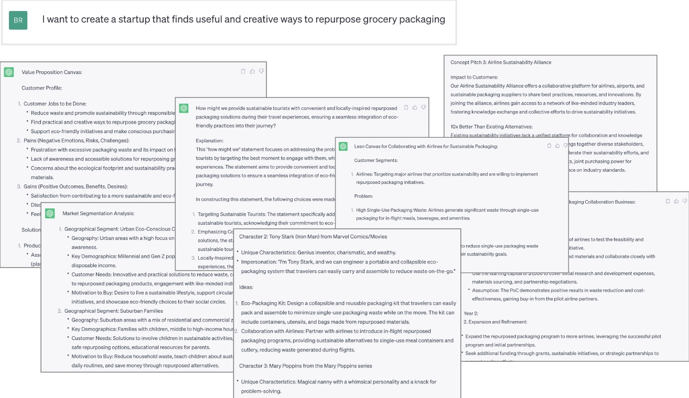
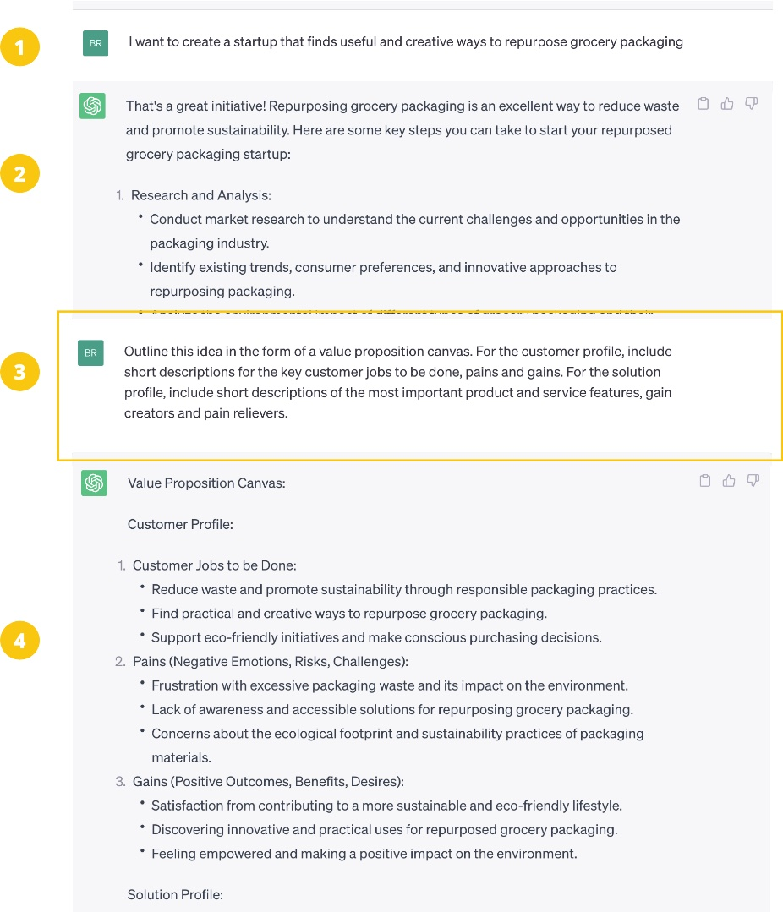

# 10x-ChatGPT-for-startups
Have you got an idea for a startup, app, product or service? This repository holds a collection of ChatGPT prompts that will make your idea 10x better. 

- Super charge your brainstorms and ideation
- Kick start your market research
- Fast track user research with synthetic users
- Roadmap your growth strategy

Choose the prompts you need. Run them through Chat GPT. Accelerate your time to market.  
  
  
  
  

## Find the Prompts you Need 
All of our ChatGPT Prompts are organised into a series of collections. Pick a collection, open the CSV file and head on over to Chat GPT.  

1. Big Idea - Get help articulating your idea as is. Do this before you go any further.
2. Market Research - Find out about the competition, and your tartget customer.
3. User Research - Synthetic user research to understand the problem you are solving.
4. Problem Definition - Frame your idea as a challenge to be solved.
5. Ideation - Generate creative ideas using lateral thinking
6. Business Model - Explore the business model. Figure out how this idea is actually going to work.
7. Problem Solution Fit - DOuble check that this is the best idea, not just the first idea.
8. Strategy - Plan out your growth strategy.
9. AI Startup - Some extra considerations for startup ideas using AI

_Read more here _

  
#### A note on Synthetic User Testing  
Some of our prompts make use of synthetic users, where Chat GPT creates imaginary personas and answers questions by impersonating those imaginary users. It's a really useful way to quickly explore your ideas, but cannot replace real user testing. 
  
Check out the folks at [Synthetic Users](https://www.syntheticusers.com/) for a more sophisticated approach to synthetic user testing.

  
## How to use the prompts
If you don't have an account with OpenAI already, you can open one [here](https://platform.openai.com/signup). Once you have that setup, login and start a new chat session [here](https://chat.openai.com/chat).     
   
**BEFORE** you start using our prompts, you are going to need to tell chat GPT about the idea you want to develop. If you need help picking an idea you could try solving one of these [Innovation Challenges](https://www.innovationchallenge.com/) , or just ask Chat GPT if it can generate a few startup ideas for you.   
  
Then, pick a prompt you like and copy paste it over to your chat GPT session. Just be aware that some prompts will reference answers from previous prompts, in which case you can either make some adjustments or just run a different prompt. 
  
Here is an example:   

   
We hope you find these prompts useful. Enjoy!

## Motivation 
There are a ton of different ways to design, develop, test and improve your new startup idea. You might test your ideas with users, create more ideas, sketch out a business model or just launch a prototype and see what happens. This all takes time, money and effort. The faster you can find out what works, and stop wasting resources on what doesn't work, the better.  

ChatGPT can help with that. With the right prompts, and a clear framework to keep you focused, you can massively accelerate your startup journey. 

   
## Community 
Please share your experiences over at the Discord Server. We would really love to know which prompts worked best, what kind of ideas you are trying them out on, and how to improve in the future. When you are ready to contribute new prompts of your own, head on over here.
  
  
## References 
If you like learning about theory, here is some reading material to get you started with startup design. 
- [Pitchlab ChatGPT Prompts](https://github.com/Pitchlab/ChatGPT-x-Ideation/blob/main/README.md) 
- [Design a Better Business](https://designabetterbusiness.com/)
- [Google Ventures Design Sprint](http://www.gv.com/sprint/)
- [The Lean Startup](https://theleanstartup.com/principles)
  

  
