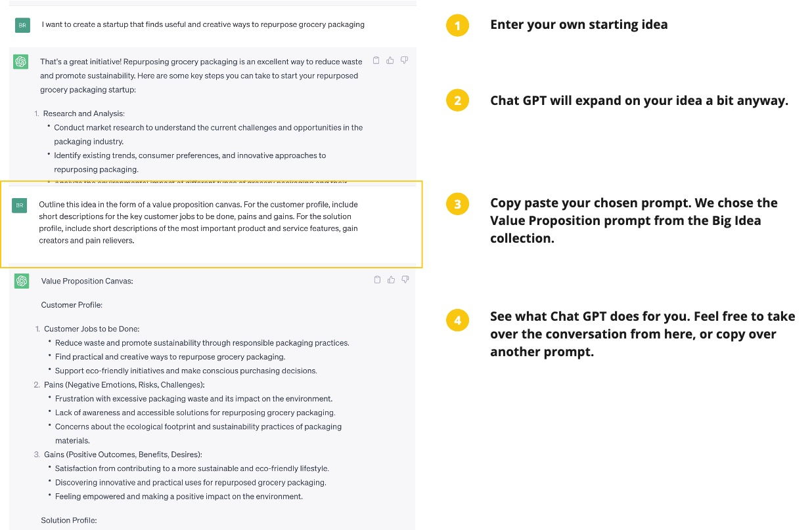

# 10x-your-ideas-with-chatGPT
Have you got an idea for a startup, app, product or service? This repository holds a collection of ChatGPT prompts that will 10x your ideas. 

- Super charge your brainstorms and ideation
- Kick start your market research
- Fast track user research with synthetic users
- Roadmap your growth strategy

Choose the prompts you need. Run them through Chat GPT. Accelerate your time to market.  
  
  
  
  

## Find the Prompts you Need 
All of our ChatGPT Prompts are organised into a series of collections. Pick a collection, open. theCSV file, and head on over to Chat GPT.  

1. Big Idea - Get help articulating your idea as is. Do this before you go any further.
2. Market Research - Find out about the competition, and your tartget customer.
3. User Research - Synthetic user research to understand the problem you are solving.
4. Problem Definition - Frame your idea as a challenge to be solved.
5. Ideation - Generate creative ideas using lateral thinking
6. Business Model - Explore the business model. Figure out how this idea is actually going to work.
7. Problem Solution Fit - DOuble check that this is the best idea, not just the first idea.
8. Strategy - Plan out your growth strategy.
9. AI Startup - Some extra considerations for startup ideas using AI

_Read more here _

  
#### A note on Synthetic User Testing  
SomeThis is where we create a range of synthetic personas, and the questions we need to ask them, and have them tell us what works and what doesn't work about our proposed solution concepts. It;s a great way to harden your idea before going out into the real world, but isn't really designed to replace actually speaking with real people. Check out [Syntehtic Users](https://www.syntheticusers.com/) for more.

  
## How to use the prompts
If you don't have an account with OpenAI already, you can open one here. Once you have that setup, login and start a new chat session here.     
   
BEFORE you start using our prompts, you are going to need to tell chat GPT about the idea you want to develop. If you need help picking an idea you could try one of these, or just ask Chat GPT to get you started.  
  
Then, pick a prompt you like, and copy paste it over to your chat GPT session. Just be aware that some prompts will reference answers from previous prompts, in which case you can either make some adhjustments or just run a different prompt. 
  
Here is an example:   

   
We hope you find these prompts useful. Enjoy!

## Motivation 
There are a ton of different ways to design, develop, test and improve your new startup idea. You might test your ideas with users, create more ideas, sketch out a business model or just launch a prototype and see what happens. This all takes time, money and effort. The faster you can find out what works, and stop wasting resources on what doesn't work, the better.  

ChatGPT can help with that. With the right prompts, and a clear framework to keep you focused, you can massively accelerate your startup journey. 

  
## Community 
Please share your experiences over at the Discord Server. We would really love to know which prompts worked best, what kind of ideas you are trying them out on, and how to improve in the future. When you are ready to contribute new prompts of your own, head on over here.
  

## References 
Some reading material to get you started with startup design. 
- ChatGPT Ideation
- Build a Better Business
- Lean Startup
- Google Design Sprint
- Startup Weekend

  
### More resources here  
[Pitchlab ChatGPT Prompts](https://github.com/Pitchlab/ChatGPT-x-Ideation/blob/main/README.md)  
[OpenAI Documentation](https://platform.openai.com/docs/introduction/overview)   

  
## License 
-- what kind of open source licence

  
## Thanks 
-- give us a star

  
